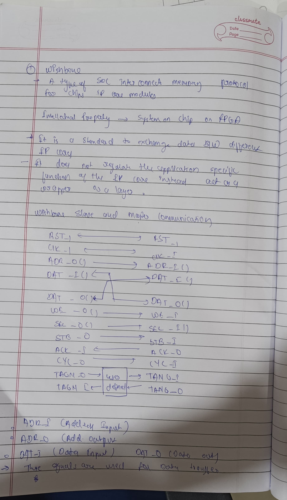
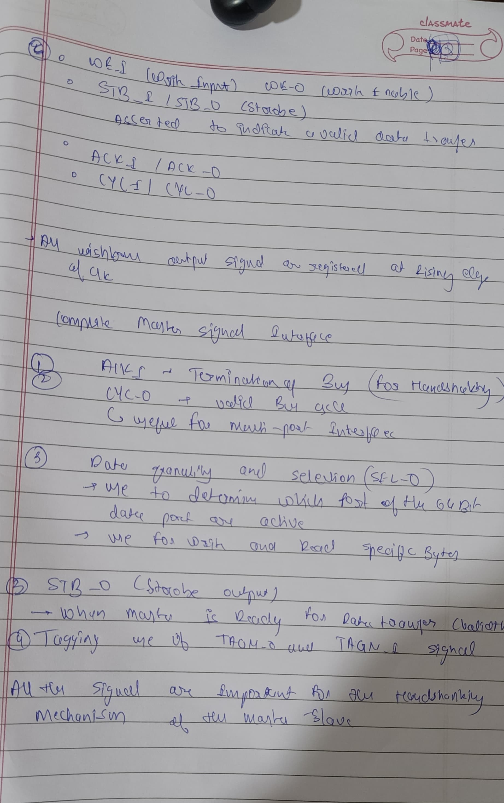
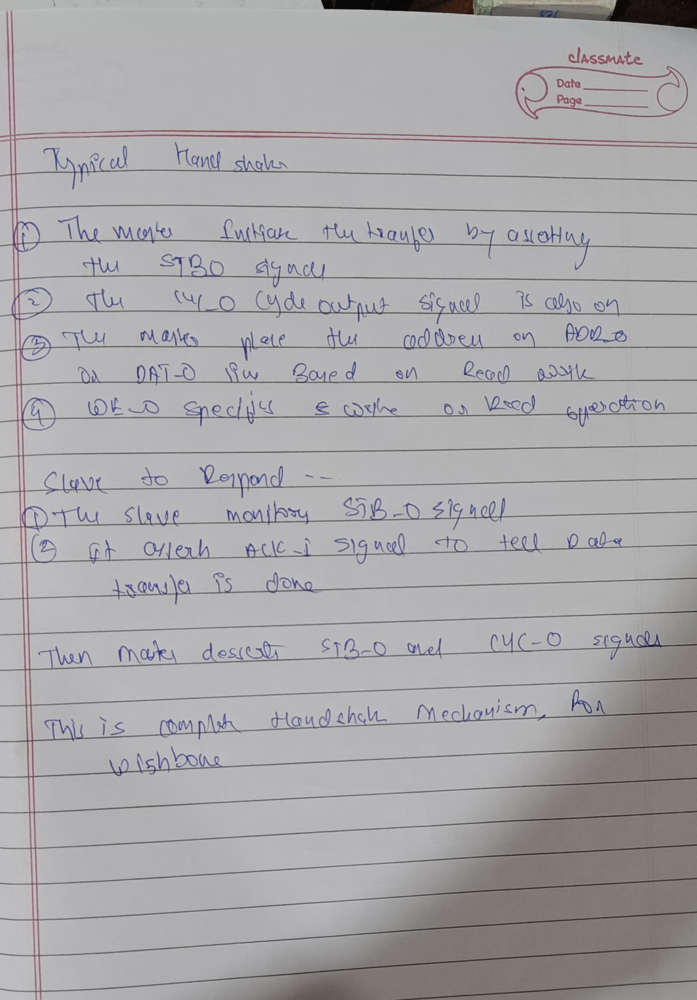

#  TBH I have not attended this seesion so i have written what i got from this assignment and online and AI
 

 

 

# Caravel Harness Chip Overview

The Caravel Harness Chip is an SoC (System on Chip) designed for embedding user projects and managing various functionalities. Below is a simplified breakdown of the main components and their roles:

## Main Components:
1. **Padframe:** Connects external signals (like GPIO, clock, reset) to internal modules.
2. **System Control:** Manages system initialization, clocking, and power-on reset (POR).
3. **GPIO Configuration and Routing:** Manages GPIO data flow and serial loading.
4. **Management SoC Wrapper:** Contains essential components for managing and interfacing with user projects.

### Subcomponents within Management SoC Wrapper:
- **SoC Core:**
  - Houses the CPU, which controls the system operations.
  - Uses the Wishbone bus to communicate with peripherals.

- **Wishbone Bus:**
  - A flexible interconnect protocol for integrating IP cores.
  - Connects CPU to peripherals like Flash controller, UART, SPI master, and GPIO.

- **Storage (Memory):**
  - Acts as the main memory for the SoC core.

- **User Project Wrapper:**
  - Enables integration of user-defined logic and peripherals.

## Key Communication Flows:
- **CPU to Peripherals:** Through the Wishbone bus, CPU interacts with components like UART and SPI.
- **External Signals:** The padframe interfaces with external GPIO, clock, and reset signals.

## Summary:
The Caravel Harness Chip offers a flexible platform for integrating user projects, while the management SoC handles essential control and interfacing. The Wishbone bus ensures efficient communication between the CPU and peripheral devices.

