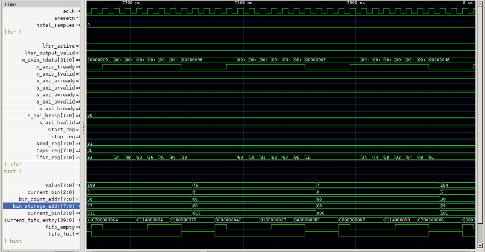
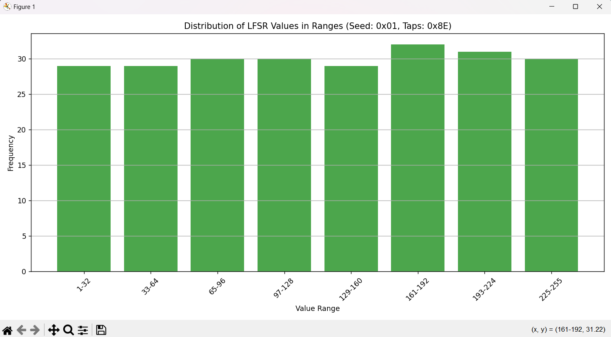
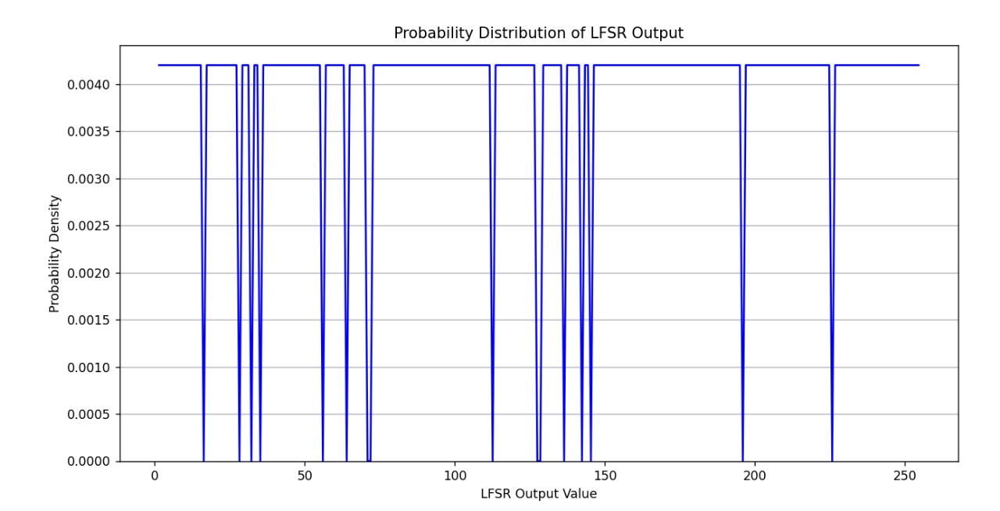

# LFSR to Histogram System Documentation

## System Overview
This system processes random numbers from an LFSR (Linear Feedback Shift Register), categorizes them into histogram bins, and stores the results in memory. The data flows through three main components:

1. **LFSR Controller (s_axil.v)** - Generates pseudo-random numbers
2. **Histogram Processor (s_m_hist.v)** - Categorizes numbers and manages bin counts
3. **Memory Controller (axi_ram.v)** - Stores histogram results

## 1. LFSR Controller (`s_axil.v`)

### Data Flow
- Receives configuration via AXI-Lite (seed, taps, start/stop)
- Generates 8-bit random numbers using LFSR algorithm
- Outputs numbers via AXI-Stream interface

### Key Components
- **AXI-Lite Slave Interface**:
  - Registers at addresses:
    - `0x00`: Start control (bit 0)
    - `0x04`: Stop control (bit 0)
    - `0x08`: Seed value (8 bits)
    - `0x0C`: Taps configuration (8 bits)

- **LFSR Core**:
  - Implements 8-bit Galois LFSR
  - Feedback: XOR of taps and current state
  - Shifts left with feedback in LSB

- **AXI-Stream Master**:
  - Outputs 32-bit words (with 8-bit random data in LSB)
  - Only valid when LFSR is active

### Important Signals
- `lfsr_reg`: Current LFSR state
- `lfsr_active`: Enabled by start/stop registers
- `feedback`: XOR result of taps and current state

## 2. Histogram Processor (`s_m_hist.v`)

### Data Flow
1. Receives 8-bit values from LFSR via AXI-Stream
2. Categorizes into 8 bins (32-255 range)
3. Stores both:
   - Bin counts (addresses 0x00-0x1C)
   - Individual values (addresses 0x20+)
4. Sends writes to memory via AXI-Stream

### Key Components
- **Bin Management**:
  - 8 bins covering ranges:
    - Bin 0: 0-32
    - Bin 1: 33-64
    - ...
    - Bin 7: 225-255
  - Each bin tracks:
    - Count (32-bit)
    - Pointer to next storage location

- **FIFO Buffer**:
  - Depth: 16 entries
  - Width: 40 bits (8b command + 32b data)
  - Commands:
    - `CMD_COUNT (0x01)`: Update bin count
    - `CMD_DATA (0x02)`: Store data value
  - Prevents backpressure by queuing writes

- **State Machine**:
  - `IDLE`: Wait for input or FIFO entries
  - `PROCESS`: Calculate bin for new value
  - `QUEUE_*`: Add operations to FIFO
  - `WRITE_TO_RAM`: Initiate memory write
  - `WAIT_RAM_ACK`: Complete write transaction

### Important Signals
- `bin_counts[8]`: Current count for each bin
- `bin_ptrs[8]`: Next storage location for each bin
- `fifo_buffer[16]`: Write operation queue

## 3. Memory Controller (`axi_ram.v`)

### Data Flow
- Receives write commands from histogram
- Stores data in 288-byte memory
- Provides debug read interface

### Key Features
- **Memory Organization**:
  - 0x00-0x1F: Bin counts (8x 32-bit)
  - 0x20-0xFF: Bin data storage
  - 0xF0: Write operation counter
  - 0xF4: Read operation counter
  - 0xF8: Debug signature (0xABCD1234)

- **AXI-Stream Interface**:
  - Write format: `[00][addr][00][data]`
  - Simple ready/valid handshake

## System Integration
## Overview
Integrates:
1. **LFSR Controller** - Random number generator
2. **Histogram Processor** - Value categorization
3. **Memory Controller** - Storage & debug

## Interfaces
| Interface       | Type         | Purpose                          |
|-----------------|--------------|----------------------------------|
| AXI-Lite Slave  | Control      | Configure LFSR registers         |
| AXI-Stream      | Data         | LFSR→Hist→RAM data pipeline      |
| Debug           | Memory read  | Access histogram results         |

## Key Parameters
parameter AXIL_ADDR_WIDTH = 4;  // AXI-Lite address
parameter AXIL_DATA_WIDTH = 32; // Control data width  
parameter RAM_ADDR_WIDTH = 8;   // 256 memory locations
parameter RAM_DATA_WIDTH = 32;  // Memory word size
## Results
---- Histogram Results ----
Bin  | Range      | Count
-----|------------|-------
-----|------------|-------
Total|            |  190

---- Histogram Visualization ----
Bin 0 | 1-32    | ###### (29)
Bin 1 | 33-64   | ###### (27)
Bin 2 | 65-96   | ###### (26)
Bin 3 | 97-128  | ###### (27)
Bin 4 | 129-160 | ###### (26)
Bin 5 | 161-192 | ###### (27)
Bin 6 | 193-224 | ###### (30)
Bin 7 | 225-255 | ###### (27)

## Python file for probability distrubution curve 

## Overview
This script implements a Linear Feedback Shift Register (LFSR) in Python to generate a pseudorandom sequence. It then plots the probability distribution of the generated numbers.

## Implementation Details
1. **LFSR Class:**  
   - Initializes with a seed, tap configuration, and bit width.  
   - Uses bitwise operations to generate the next state based on the feedback mechanism.  
   - Provides a method to generate a sequence of numbers.  

2. **Probability Distribution Plot:**  
   - Uses Matplotlib to visualize the distribution of the generated sequence.  
   - The histogram displays the probability of each value occurring, illustrating the randomness of the LFSR output.  

## Usage  
Run the script to generate a pseudorandom sequence of 10,000 numbers and visualize the distribution. Ensure that `numpy` and `matplotlib` are installed.  

### Connection Diagram
## GTKWAVE waveform result
 
*Figure 1: System timing diagram showing AXI transactions between modules*

## Python Histogram result
 

## probability distribution curve
 

