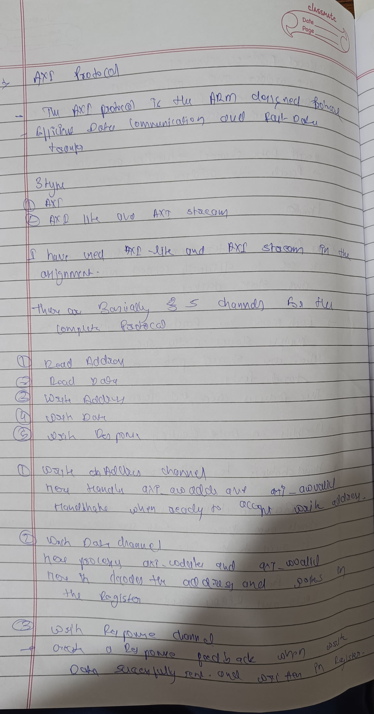
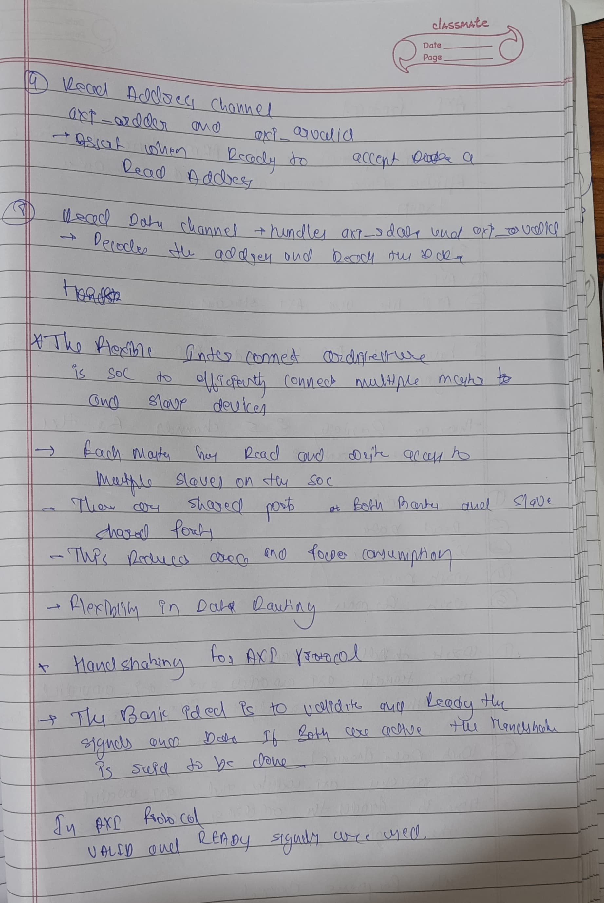
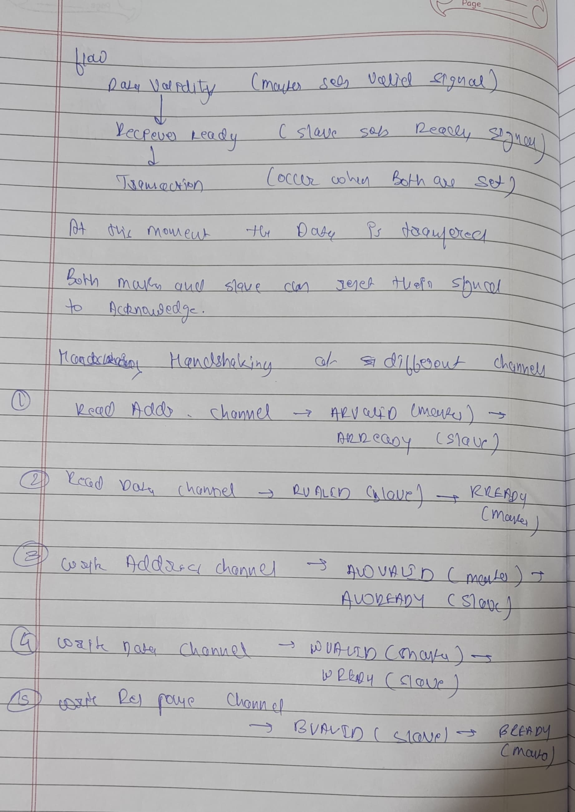
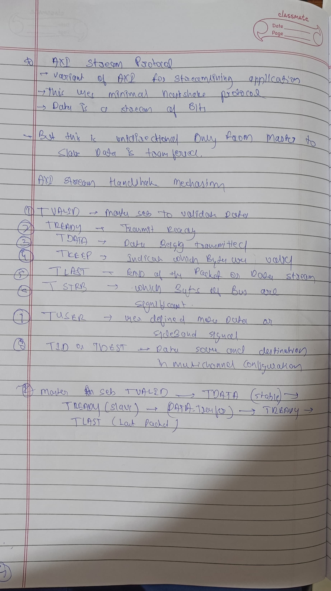

# AXI and AXI Stream Protocols

## AXI Protocol
The AXI (Advanced eXtensible Interface) protocol is part of the ARM AMBA (Advanced Microcontroller Bus Architecture) specification. It is designed for high-performance, high-frequency system-on-chip (SoC) communication. AXI supports:
- High throughput via multiple outstanding transactions.
- Independent read and write channels.
- Burst-based data transfer, allowing efficient memory access.
- Low latency communication through separate address/control and data phases.

### Key Features:
- **Five independent channels:** Read address (AR), Read data (R), Write address (AW), Write data (W), and Write response (B).
- **Handshaking mechanism:** Uses VALID and READY signals for data transfer synchronization.
- **Burst transactions:** Efficient data transfer for large data blocks.
 
 
 

## AXI Stream Protocol
AXI Stream is designed for continuous, high-speed data streaming. Unlike standard AXI, it doesn't include address or response channels. It is commonly used for data transfer in multimedia applications, signal processing, and packet-based communication.

### Key Features:
- **Simple Data Flow:** Uses TDATA, TVALID, TREADY, and TLAST signals for unidirectional data streaming.
- **No Addressing:** Focuses on data movement without specifying source or destination addresses.
- **Streaming Nature:** Suitable for real-time data transfer, like video or audio streams.

 

Both protocols offer flexibility and efficiency, with AXI suited for memory-mapped data transfer and AXI Stream for continuous data flow.

