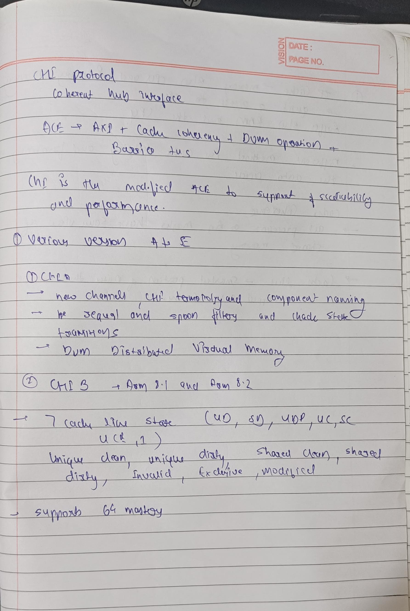

# CHI Protocol: Comprehensive Explanation

## Explaination of Cache and Cache line and coherence 
 
 

## Introduction to the CHI Protocol

The CHI (Coherent Hub Interface) protocol is ARM's advanced interconnect architecture designed for high-performance computing systems, particularly in System-on-Chip (SoC) designs. It defines a comprehensive framework for communication between different nodes in a system, ensuring data coherency, efficient routing, and reliable message exchange.

## CHI Master Interface and Channels
 The CHI Master Interface (exemplified by RN-F, a Requesting Node with Forward capability) implements several key channels:

- **TXREQ**: Transmit Request channel - used to send requests
- **TXDAT**: Transmit Data channel - used to send data
- **TXRSP**: Transmit Response channel - used to send responses
- **RXSNP**: Receive Snoop channel - used to receive snoop requests
- **RXDAT**: Receive Data channel - used to receive data
- **RXRSP**: Receive Response channel - used to receive responses

These channels support different types of transactions:
- Requests for Read/Write operations
- Cache Maintenance Operations
- DVM (Distributed Virtual Memory) Requests

## Node Channels and Communication Pathways

### Node Types
- **RN-F**: Request Node with Forward capability
- **HN-F**: Home Node with Forward capability
- **RN-I**: Request Node with Intermediate capability
- **HN-I**: Home Node with Intermediate capability
- **RN-D**: Request Node with Direct capability
- **DN**: Direct Node
- **HN**: Home Node
- **SN**: Service Node

### Channel Communication
Each node pair exchanges messages through complementary TX/RX channels:
- Request nodes transmit requests (TXREQ) that are received (RXREQ) by home nodes
- Data flows from transmitting nodes (TXDAT) to receiving nodes (RXDAT)
- Responses flow from responding nodes (TXRSP) to receiving nodes (RXRSP)

## Key CHI Protocol Operations

### SNP (Snoop) Operations
Snooping is a critical mechanism for maintaining cache coherency in multi-processor systems. When a node needs to access data that might be cached elsewhere:

1. A snoop request (TXSNP) is sent to potentially caching nodes
2. Caching nodes check their caches for the requested data
3. Caching nodes respond with the data status and potentially the data itself
4. This ensures all caches have a consistent view of memory

RN-F node receives snoops (RXSNP) from HN-F, which transmits snoop requests (TXSNP).

### DVM (Distributed Virtual Memory) Operations
DVM operations manage virtual memory across multiple processing elements:

1. When a processor changes a virtual memory mapping, it needs to inform other processors
2. DVM requests are broadcast to relevant nodes
3. Each node invalidates affected cache entries and TLB (Translation Lookaside Buffer) entries
4. Nodes send acknowledgments when complete

RN-D node receives DVM operations (RXSNP ← TXSNP labeled as "DVMs") from DN.

### Data Read and Write Operations
These are fundamental operations in the CHI protocol:

- **Read Operations**: A node requests data from memory or another cache
  1. Request node sends a read request (TXREQ)
  2. Home node receives request (RXREQ) and processes it
  3. Data is returned via TXDAT → RXDAT channels
  4. Completion is signaled via TXRSP → RXRSP channels

- **Write Operations**: A node updates data in memory
  1. Request node sends a write request (TXREQ)
  2. Data to be written is sent via TXDAT channel
  3. Home node confirms reception and processing
  4. Completion is acknowledged

## Transaction Flow and Advanced Concepts

### ReadNoSnp Transaction
A ReadNoSnp transaction is a read operation that doesn't require snoop operations:

1. Used when the requesting node knows the data isn't cached elsewhere
2. Bypasses the snoop phase, making it more efficient
3. Reduces latency and network traffic
4. Commonly used for non-cacheable data or known exclusive access

### Request and Response Identifiers
The CHI protocol uses various identifiers to track and manage transactions:

- **TgtID**: Target Identifier - specifies the destination
- **SrcID**: Source Identifier - indicates the origin
- **TxnID**: Transaction Identifier - uniquely tracks a transaction
- These identifiers ensure proper routing and acknowledgment of messages

### Completion Acknowledgements
Completion acknowledgements (CompAck in the original diagram) confirm the successful completion of a transaction:

1. Sent after all data has been received and processed
2. Includes the transaction ID to match with the original request
3. Allows the system to free resources associated with the transaction
4. Ensures reliable communication by confirming receipt

### Request Order and Request Endpoint Order
The CHI protocol maintains specific ordering rules:

- **Request Order**: The sequence in which requests are processed
  - Critical for maintaining data consistency
  - Follows program order when necessary
  - Can be relaxed for performance when safe

- **Request Endpoint Order**: Ordering at the final destination
  - Ensures requests to the same address are processed in the correct sequence
  - Prevents race conditions and ensures memory consistency
  - May differ from initial request order due to routing and priorities

## Practical Implementation of CHI Protocol

The complete CHI transaction shown in the original diagram illustrates how these concepts work together:

1. A request node initiates a transaction with appropriate identifiers
2. The request travels through the system, potentially requiring snoop operations
3. Data and responses flow back to the requesting node
4. Completion is acknowledged, and the transaction is finalized

This sophisticated protocol enables modern SoC designs to achieve high performance while maintaining data coherency across multiple processing elements and complex memory hierarchies.

## Summary of Key CHI Protocol Elements

| Component | Description |
|-----------|-------------|
| TXREQ/RXREQ | Transmit/Receive Request channels |
| TXDAT/RXDAT | Transmit/Receive Data channels |
| TXRSP/RXRSP | Transmit/Receive Response channels |
| TXSNP/RXSNP | Transmit/Receive Snoop channels |
| SNP Operations | Cache coherency maintenance mechanisms |
| DVM Operations | Distributed virtual memory management |
| ReadNoSnp | Efficient read without snoop requirements |
| CompAck | Completion acknowledgement |
| Request Order | Sequence of request processing |
| TgtID, SrcID, TxnID | Transaction tracking identifiers |