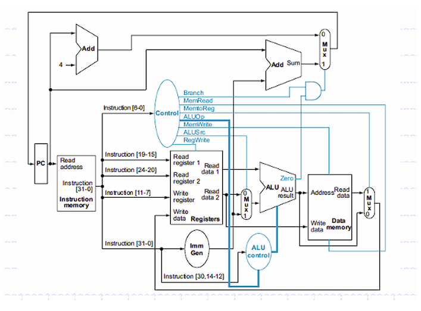
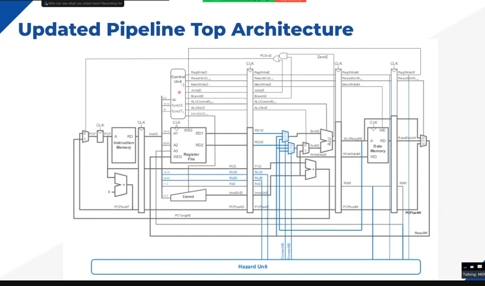

# RISC-V Single Cycle and Pipelined CPU Project

## Student Details
- **Name:** Soham Palkrit
- **Department:** Electrical and Electronics Engineering (EEE)
- **Roll Number:** 231EE142
- **Contact:** 93220887306

## Implementation 

## Project Overview
Brief description of the RISC-V CPU implementation

## Key Components
- Single Cycle CPU
- Pipelined CPU Architecture

